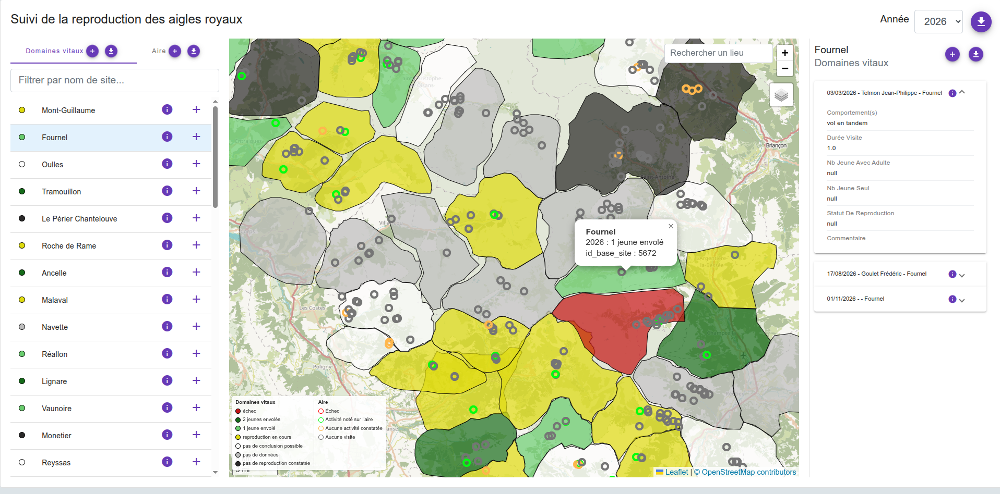

# Monitoring year synthese



Module GeoNature pour la visualisation cartographique des données monitoring par année.

Ce module n'a pas de backend propre : il consomme directement
l'API de `gn_module_monitoring`. C'est un simple frontend Angular.

Pour faire fonctionner le module il est nécéssaire au préalable de créer un export monitoring qui remet à plat tout les sites du modules pour chaque année (voir l'exemple plus bas). Cet export doit contenir un champs sur lequel la légende de la carte va s'appuyer

## Configuration

Copier `monitoring_year_synthese_config.toml.example` en
`config/monitoring_year_synthese_config.toml.example` dans le répertoire de GeoNature, et déclarer
un bloc `[[PAGES]]` par sous module monitoring. Une page peut combiner
plusieurs sous-modules gn_module_monitoring sur une même carte (ex: aigle +
domaine_vital)

Ci dessous un exemple de configuration qui se base sur le module STOM

```toml
[[PAGES]]
page_code = "stom" # utilisé pour la sous route du module
page_label = "STOM"

  [[PAGES.modules]]
  module_code = "STOM" # code du module monitoring
  module_label = "STOM"
  site_export_name = "site_visit_count" # nom de l'export monitoring utilisé par le module
  legend_field = "legend_field" # nom du champs de la vue ou de l'API /site utilisé pour créer la légende
  site_geom_type = "point" # -> type des objet du module monitoring
    # Légende
    [[PAGES.modules.legend_values]]
    value = "pas de visite"
    label = "Pas de visite"
    color = "#bdbdbd"

    [[PAGES.modules.legend_values]]
    value = "1 à 10 visite"
    label = "1 à 10 visites"
    color = "#66bb6a"

    [[PAGES.modules.legend_values]]
    value = "plus de 10 visite"
    label = "Plus de 10 visites"
    color = "#1b5e20"
```

Autres paramètre :

- `visit_export_name` (optionnel) : suffixe de la vue d'export SQL des
  visites d'un site (panneau de droite). Non renseigné, le panneau retombe
  sur l'API générique `/refacto/<module_code>/visits` de
  gn_module_monitoring
- `visit_fields`: liste des champs de visite à afficher sur le détail des visite dans le panneau latéral de droite

Il est possible de créer une page qui aggègre plusieurs module monitoring. Pour cela dupliquez la section ``[[PAGES.modules]]` et créer une seconde vue d'export

Sur une page à plusieurs sous-modules : la carte affiche tous les sites de tous les sous-modules ensemble, et la liste latérale affiche un onglet par sous-module.

## Vues d'export

Les sites sont chargés exclusivement via les vues d'export
SQL de gn_module_monitoring (`site_export_name`), cette vue
permet de mettre à plat, côté SQL, toute la logique métier et de mettre en forme le résultat que l'on souhaite sur la carte.

Une vue d'export se déclare comme n'importe quelle vue du module monitoring: un fichier `.sql` dans `exports/csv/` de la configuration sous-module.

### Vue de sites (`site_export_name`)

Voici les colonnes obligatoires de la vue des sites :

- `id_base_site`
- `base_site_name`
- `geom` : en geojson 4326 via st_asgeojson(site.geom)
- `annee`: seulement l'année, pas la date entière
- `legend_field` : nom de la colonne sur laquelle la légende s'appuye

Si vous souhaitez que tous les sites apparaissent tous les ans (et pas uniquement les site ayant au moin une visite l'année courante), inspirez vous de la vue suivante (via `CROSS JOIN`)

```sql
CREATE OR REPLACE VIEW gn_monitoring.v_export_stom_site_visit_count
AS
WITH visit_count AS (
  -- Nombre de visites par site et par année (uniquement les années où le
  -- site a été visité).
  SELECT
    bv.id_base_site,
    EXTRACT(YEAR FROM bv.visit_date_min)::integer AS annee,
    count(*) AS nb_visite
  FROM gn_monitoring.t_base_visits bv
    JOIN gn_commons.t_modules m ON m.id_module = bv.id_module AND m.module_code = 'stom'
  GROUP BY bv.id_base_site, EXTRACT(YEAR FROM bv.visit_date_min)::integer
),
sites AS (
  SELECT
    s.id_base_site,
    s.base_site_name,
    st_asgeojson(s.geom) AS geom
  FROM gn_monitoring.t_base_sites s
  WHERE EXISTS (
    -- Lien site <-> module : cor_site_type + cor_module_type (cf. plus haut),
    -- pas cor_site_module.
    SELECT 1
    FROM gn_monitoring.cor_site_type cst
      JOIN gn_monitoring.cor_module_type cmt ON cmt.id_type_site = cst.id_type_site
      JOIN gn_commons.t_modules mod ON mod.id_module = cmt.id_module AND mod.module_code = 'stom'
    WHERE cst.id_base_site = s.id_base_site
  )
),
-- Toutes les années couvertes par le module, de la première visite à
-- aujourd'hui (année courante incluse même sans visite).
annees AS (
  SELECT generate_series(
    COALESCE((SELECT MIN(annee) FROM visit_count), EXTRACT(YEAR FROM CURRENT_DATE)::integer),
    EXTRACT(YEAR FROM CURRENT_DATE)::integer
  ) AS annee
)
SELECT
  sites.id_base_site,
  sites.base_site_name,
  sites.geom,
  annees.annee,
  COALESCE(vc.nb_visite, 0) AS nb_visite,
  CASE
    WHEN COALESCE(vc.nb_visite, 0) = 0 THEN 'pas de visite'
    WHEN vc.nb_visite < 10 THEN '1 à 10 visite'
    ELSE 'plus de 10 visite'
  END AS legend_field
FROM sites
  -- Un site × chaque année couverte, même sans visite cette année-là.
  CROSS JOIN annees
  LEFT JOIN visit_count vc
    ON vc.id_base_site = sites.id_base_site AND vc.annee = annees.annee
;
```

### Vue de visites (`visit_export_name`)

Voici la lite des champs obligatoires dans la vue de visite

- `id_base_site`
- `annee` : seulement l'année, pas la date entière
- `id_base_visit`

Tous les autres champs de la vue seront affiché dans le panneau latéral du détail d'une visite. Il est possible de configurer la liste (et l'ordre) des champs via le paramètre `visit_fields`
